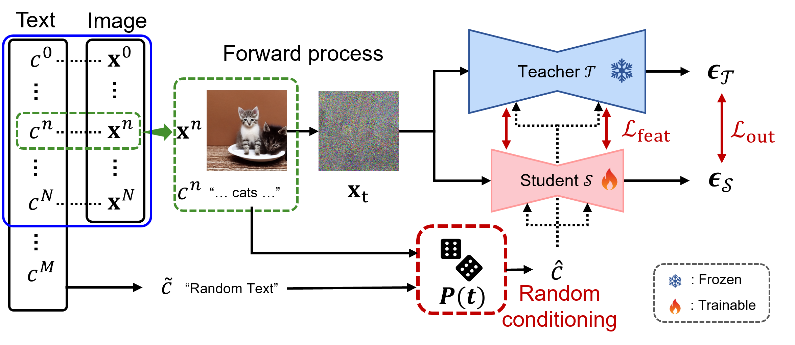

<div style="display: flex; justify-content: center; align-items: center; gap: 50px;">
  
  
  
</div>

# Random Conditioning with Distillation for Data-Efficient Diffusion Model Compression (CVPR 2025)

[[arXiv](https://arxiv.org/abs/2504.02011)] [[Project Page](https://dohyun-as.github.io/Random-Conditioning/)] [[Dataset](#)]<br>

by Dohyun Kim, Sehwan Park, Geonhee Han, [Seung Wook Kim](https://seung-kim.github.io/seungkim/), [Paul Hongsuck Seo](https://phseo.github.io/)

This is the official repository for our CVPR 2025 paper: **Random Conditioning with Distillation for Data-Efficient Diffusion Model Compression**. We propose a novel random conditioning strategy to enable image-free, efficient knowledge distillation of conditional diffusion models.

Our code builds on top of [BKSDM](https://github.com/Nota-NetsPresso/BK-SDM).

## Overview



We propose **Random Conditioning**, a technique that pairs noised images with randomly selected text prompts to enable student diffusion models to generalize beyond the limited concept space of training data. This allows effective compression of large diffusion models without requiring large-scale paired datasets.

For further details, please check out our [paper](#) and our [project page](https://dohyun-as.github.io/Random-Conditioning/).

## Installation

```bash
conda create -n rand-cond python=3.8
conda activate rand-cond
git clone https://github.com/dohyun-as/Random-Conditioning.git
cd Random-Conditioning
pip install -r requirements.txt
```

Make sure to install PyTorch compatible with your CUDA version from [https://pytorch.org](https://pytorch.org).

## Data Preparation

<!-- You can prepare the data following the guidance from the BK-SDM repo, as our code builds on top of [BKSDM](https://github.com/Nota-NetsPresso/BK-SDM). -->

## Training

<!-- Run the training script with the desired configuration:

```bash
python train.py --config configs/randcond.yaml
```

The configuration file allows you to toggle options like random conditioning, use of additional texts, and model size. -->

## Evaluation

<!-- Evaluate a trained model with:

```bash
python eval.py --config configs/eval.yaml --checkpoint [path_to_checkpoint]
```

Evaluation will report FID, IS, and CLIP scores on standard benchmarks (e.g., DiffusionDB). -->

## Acknowledgement

Our implementation is based on [BK-SDM](https://github.com/Nota-NetsPresso/BK-SDM). We thank the authors for their open-source contributions.

## Bug or Questions?
If you have any questions, feel free to email Dohyun (a12s12@korea.ac.kr). If you come across any issues or bugs while using the code, you can open an issue. Please provide detailed information about the problem so we can assist you more efficiently!

## Citation

If you use our code or findings, please cite:

```bibtex
@InProceedings{Kim_2025_CVPR,
    author    = {Kim, Dohyun and Park, Sehwan and Han, Geonhee and Kim, Seung Wook and Seo, Paul Hongsuck},
    title     = {Random Conditioning for Diffusion Model Compression with Distillation},
    booktitle = {Proceedings of the Computer Vision and Pattern Recognition Conference (CVPR)},
    month     = {June},
    year      = {2025},
    pages     = {18607-18618}
}
```
